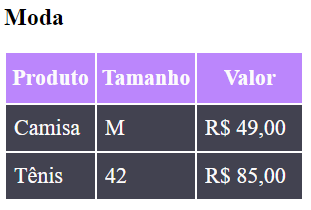
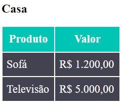

# Quest HTML e CSS Basico - Tabelas 

 Exercicio realizado durante o curso DevQuest, com o intuito de aplicar os conhecimentos adquiros durante o modulo de HTML e CSS basico. 

 ## Visão do projeto

[]

[]

## Tecnologias utilizadas

- HTML
- CSS

